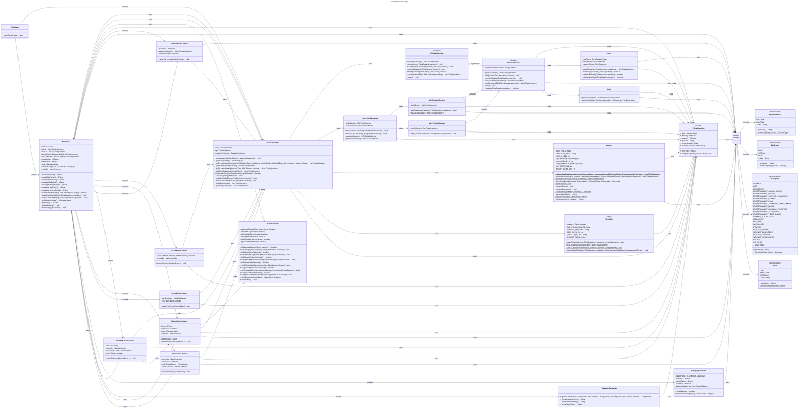

# Final UML Diagram

```mermaid
---
title: TriviaApp Final Design
---
classDiagram
  direction LR

  TriviaApp --> MainController : creates
  TriviaApp --> MainView : creates
  MainView --> MainController : has

  MainController --> ITriviaCollection : uses
  MainController --> QuestionExchange : uses
  MainController --> APIUtils : uses
  MainController --> FileUtilities : uses
  MainController --> TriviaQuestion : uses

  ITriviaCollection <|-- TriviaCollection : implements
   
  TriviaCollection --> TriviaQuestion : uses
  TriviaCollection --> Filters : uses
  TriviaCollection --> Enums : uses
  TriviaCollection --> Sorter : uses

  UserTriviaCollection --|> TriviaCollection : extends
  UserTriviaCollection --> TriviaQuestion : uses
  
  APITriviaCollection --|> TriviaCollection : extends
  APITriviaCollection --> TriviaQuestion : uses
  APITriviaCollection --> Enums : uses

  TriviaQuestion --> Enums : uses

  FileUtilities --> TriviaQuestion : uses

  APIUtils --> TriviaQuestion : uses
  APIUtils --> Enums : uses

  Filters --> Enums : uses
  Filters --> TriviaQuestion : uses

  QuestionExchange --> APITriviaCollection : uses
  QuestionExchange -->  UserTriviaCollection : uses
  QuestionExchange --> TriviaQuestion : uses

  Sorter --> TriviaQuestion : uses
  Sorter --> Enums : uses

  MainView <--> MainController : uses
  MainView --> MainViewState : uses
  MainView --> TriviaQuestion : uses
  MainView --> ApiPullActionListener : creates
  MainView --> Enums : uses
  MainView --> LoadActionListener : creates
  MainView --> FilterActionListener : creates
  MainView --> MoveToActionListener : creates
  MainView --> ApiPullActionListener : creates
  MainView --> SortActionListener : creates
  MainView --> SaveActionListener : creates
  MainView --> CategorySelection : creates
  MainView --> QuestionRenderer : creates

  ApiPullActionListener --> Enums : uses
  ApiPullActionListener --> MainController : uses

  CategorySelection --> Enums : uses

  FilterActionListener --> MainView : uses
  FilterActionListener --> MainViewState : uses
  FilterActionListener --> MainController : uses
  FilterActionListener --> TriviaQuestion : uses
  FilterActionListener --> Enums : uses

  LoadActionListener --> MainController : uses
  LoadActionListener --> TriviaQuestion : uses

  MoveToActionListener --> MainView : uses
  MoveToActionListener --> MainController : uses
  MoveToActionListener --> TriviaQuestion : uses
  MoveToActionListener --> FilterActionListener : uses

  QuestionRenderer --> TriviaQuestion : uses

  SaveActionListener --> MainController : uses
  SaveActionListener --> TriviaQuestion : uses

  SortActionListener --> MainController : uses
  SortActionListener --> MainView : uses
  SortActionListener --> TriviaQuestion : uses
  SortActionListener --> Enums : uses
  
  Enums --> QuestionType : contains
  Enums --> Difficulty : contains
  Enums --> Category : contains
  Enums --> Field : contains
    

   class TriviaApp {
      + main(String[] args) : void
   }

   class MainController {
      - user : ITriviaCollection
      - api : ITriviaCollection
      - questionExchange : QuestionExchange
      
     + generateApiList(List~Category~ selectedCategories) : void
     + getAllCategories() : Set~Category~
     + getFormattedApiQuestions(Set~QuestionType~ typeFilters, Set~Difficulty~ difficultyFilters, Set~Category~ categoryFilters) : List~TriviaQuestion~
     + getFormattedApiQuestions() : List~TriviaQuestion~
     + getFormattedUserQuestions(Field field, Boolean sortOrder) : List~TriviaQuestion~
     + loadTriviaQuestions(String filePath) : List~TriviaQuestion~
     - isDuplicateQuestion(TriviaQuestion newQuestion) : boolean
     + saveTrivia(String folderPath) : void
     + moveToUserCollection(TriviaQuestion question) : void
     + moveToApiCollection(TriviaQuestion question) : void
     + getApiQuestions() : List~TriviaQuestion~
     + getUserQuestions() : List~TriviaQuestion~
   }

   class ITriviaCollection {
      <<interface>>
     + getAllQuestions() : Set~TriviaQuestion~
     + addQuestion(TriviaQuestion question) : void
     + addQuestions(Collection~TriviaQuestion~ questions) : void
     + removeQuestion(TriviaQuestion question) : void
     + filterQuestions(Filters filter) : Set~TriviaQuestion~
     + sortQuestions(Field field, boolean ascending) : List~TriviaQuestion~
     + reset() : void
   }

   class TriviaCollection {
     <<abstract>>
     + originalCollection : #Set~TriviaQuestion~ 

     + getAllQuestions() : Set~TriviaQuestion~
     + addQuestion(TriviaQuestion question) : void
     + removeQuestion(TriviaQuestion question) : void
     + filterQuestions(Filters filters) : Set~TriviaQuestion~
     + sortQuestions(Field field, boolean ascending) : List~TriviaQuestion~
     + reset() : void
     + contains(TriviaQuestion question) : boolean
   }

  class UserTriviaCollection { 
    - userCollection : Set~TriviaQuestion~

    + addQuestions(Collection~TriviaQuestion~ questions) : void
  }

  class APITriviaCollection {
    - apiCollection : Set~TriviaQuestion~

    + addQuestions(Collection~TriviaQuestion~ questions) : void
    + getAllCategories() : Set~Enums.Category~
  }

  class TriviaQuestion {
    <<record>>
    + type : QuestionType
    + difficulty : Difficulty
    + category : Difficulty
    + question : String
    + correctAnswer : String
    + incorrectAnswers : List~String~
    
    + toString() : String
    + compareTo(TriviaQuestion other) : int
  }

  class FileUtilities {
    <<utility>>
    - mapper$ : ObjectMapper 
    - QUESTION_HEADER$ : String
    - ANSWER_HEADER$ : String
    - JSON_FILE$ : String
    - QUESTION_FILE$ : String
    - ANSWER_FILE$ : String

    + saveTrivia(Collection~TriviaQuestion~ questions, String folderName)$ : void
    + loadTrivia(String jsonFilePath)$ : List~TriviaQuestion~
    - saveAsJson(Collection~TriviaQuestion~ questions, String filePath)$ : void
    - saveAsText(Collection~TriviaQuestion~ questions, String questionsFilePath, String answersFilePath)$ : void
  }
  
  class Enums {
    <<static>>
  }

  class QuestionType {
    <<enumeration>>
    BOOLEAN
    MULTIPLE
    - value : String 
    
    + getValue() : String
    + fromValue(String value)$ : QuestionType
  }

  class Difficulty {
    <<enumeration>>
    EASY
    MEDIUM
    HARD
    - value : String
    + getValue() : String
    + fromValue(String value)$ : Difficulty
  }

  class Category {
    <<enumeration>>
    ANIMALS
    ART
    CELEBRITIES
    ENTERTAINMENT_BOARD_GAMES
    ENTERTAINMENT_BOOKS
    ENTERTAINMENT_CARTOON_ANIMATIONS
    ENTERTAINMENT_COMICS
    ENTERTAINMENT_FILM
    ENTERTAINMENT_JAPANESE_ANIME_MANGA
    ENTERTAINMENT_MUSIC
    ENTERTAINMENT_MUSICALS_THEATRES
    ENTERTAINMENT_TELEVISION
    ENTERTAINMENT_VIDEO_GAMES
    GENERAL_KNOWLEDGE
    GEOGRAPHY
    HISTORY
    MYTHOLOGY
    POLITICS
    SCIENCE_NATURE
    SCIENCE_COMPUTERS
    SCIENCE_GADGETS
    SCIENCE_MATHEMATICS
    SPORTS
    VEHICLES
    
    - value : String
    + getValue() : String
    + fromValue(String value)$ : Category
  }

  class Field {
    <<enumeration>>
    TYPE
    DIFFICULTY
    CATEGORY
    
    - value : String 
    + getValue() : String
    + fromValue(String value)$ : Field
  }

  class MainView {
    - frame : JFrame
    - apiList : JList~TriviaQuestion~
    - userList : JList~TriviaQuestion~
    - apiListModel : DefaultListModel~TriviaQuestion~
    - userListModel : DefaultListModel~TriviaQuestion~
    - toUserButton : JButton
    - toApiButton : JButton
    - state : MainViewState
    - selectedCategories : List~Enums.Category~
    - controller : MainController
    
    - createLeftPanel() : JPanel
    - createRightPanel() : JPanel
    - createCenterPanel() : JPanel
    - createApiTopPanel() : JPanel
    - createApiBottomPanel() : JPanel
    - createUserTopPanel() : JPanel
    - createUserBottomPanel() : JPanel
    - createIconButton(String path, int width, int height) : JButton
    + updateApiListModel(List~TriviaQuestion~ questions) : void
    + updateUserListModel(List~TriviaQuestion~ questions) : void
    + getCheckboxState() : MainViewState
    + getFrame() : JFrame
    + updateButtons() : void
    - showCategorySelection() : void
  }

  class APIUtils {
    - BASE_URL$ : String
    - CATEGORY_URL$ : String
    - BATCH_SIZE$ : int
    - objectMapper$ : ObjectMapper
    - sessionToken$ : String
    - categoryMap$ : Map~String, String~
    - MAX_RETRIES$ : int
    - RETRY_DELAY_MS$ : int

    + getBatchedQuestions(int amount, Enums.Category category, Enums.Difficulty difficulty, Enums.QuestionType type)$ : List~TriviaQuestion~
    + getSingleQuestions(int amount, Enums.Category category, Enums.Difficulty difficulty, Enums.QuestionType type)$ : List~TriviaQuestion~
    + convertQuestions(JsonNode jsonNode)$ : List~TriviaQuestion~
    + fetchQuestions(int amount, String category, String difficulty, String type)$ : JsonNode
    + resetToken()$ : void
    + requestToken()$ : void
    + requestCategories()$ : void
    - sendGetRequest(String urlString)$ : JsonNode
    + getSessionToken()$ : String
    + getCategoryMap()$ : Map~String, String~
    + htmlConverter(String input)$ : String
  }

  class Filters {
    - typeFilters : Set~QuestionType~
    -difficultyFilters : Set~Difficulty~
    - categoryFilters : Set~Category~

    + applyFilters(Set~TriviaQuestion~ questions) : Set~TriviaQuestion~
    - matchesType(TriviaQuestion question) : boolean
    - matchesDifficulty(TriviaQuestion question) : boolean
    - matchesCategory(TriviaQuestion question) : boolean
  }

  class QuestionExchange {
    - apiCollection : APITriviaCollection
    - userCollection : UserTriviaCollection

    + moveToUserCollection(TriviaQuestion question) : void
    + moveToApiCollection(TriviaQuestion question) : void
    + getApiCollection() : APITriviaCollection
    + getUserCollection(): UserTriviaCollection
  }

  class Sorter {
    + getSort(Field field) : Comparator~TriviaQuestion~
    + getSort(Field field, boolean ascending) : Comparator~TriviaQuestion~ 
   }

   class ApiPullActionListener {
    - mainView : MainView
    - selectedCategories : List~Enums.Category~
    - controller : MainController
    
    + actionPerformed(ActionEvent e) : void
   }

   class CategorySelection {
    - categoryList : JList~Enums.Category~
    - okButton : JButton
    - cancelButton : JButton
    - confirmed : boolean
    - selectedCategories : List~Enums.Category~

    + showDialog() : boolean
    + getSelectedCategories() : List~Enums.Category~
    }
   
   class FilterActionListener {
    - frame : JFrame
    - mainView : MainView
    - state : MainViewState
    - controller : MainController

    +applyFilters() : void
    +actionPerformed(ActionEvent e) : void
   }
   
   class LoadActionListener {
    - userListModel : DefaultListModel~TriviaQuestion~
    - controller : MainController

    +actionPerformed(ActionEvent e) void
   }
   
   class MainViewState {
    - categorySelectedMap : Map~String, Boolean~
    - difficultyEasySelected : boolean
    - difficultyMediumSelected : boolean
    - difficultyHardSelected : boolean
    - typeMultipleChoiceSelected : boolean
    - typeTrueFalseSelected : boolean

    + isCategorySelected(String category) : boolean
    + setCategorySelected(String category, boolean selected) : void
    + isDifficultyEasySelected() : boolean
    + setDifficultyEasySelected(boolean difficultyEasySelected) : void
    + isDifficultyMediumSelected() : boolean
    + setDifficultyMediumSelected(boolean difficultyMediumSelected) : void
    + isDifficultyHardSelected() : boolean
    + setDifficultyHardSelected(boolean difficultyHardSelected) : void
    + isTypeMultipleChoiceSelected() : boolean
    + setTypeMultipleChoiceSelected(boolean typeMultipleChoiceSelected) : void
    + isTypeTrueFalseSelected() : boolean
    + setTypeTrueFalseSelected(boolean typeTrueFalseSelected) : void
    + getCategorySelectedMap() : Map~String, Boolean~
    + resetFilters() : void
   }
   
   class MoveToActionListener {
    - view : MainView
    - controller : MainController
    - sourceList : JList~TriviaQuestion~
    - moveToUser : boolean
      
    +actionPerformed(ActionEvent e) : void
   }

   class QuestionRenderer {
    + getListCellRendererComponent(JList~? extends TriviaQuestion~, TriviaQuestion, int, boolean, boolean) : Component
    - formatCategory(String) : String
    - formatDifficulty(String) : String
    - formatType(String) : String
    }
    
   class SaveActionListener {
    - userListModel : DefaultListModel<TriviaQuestion>
    - controller : MainController
        
    + actionPerformed(ActionEvent) : void
    }
    
   class SortActionListener{
    - controller : MainController
    - mainView : MainView
    - orderToggleButton : JToggleButton
    - userListModel : DefaultListModel<TriviaQuestion>

    +actionPerformed(ActionEvent) : void
    }

```
