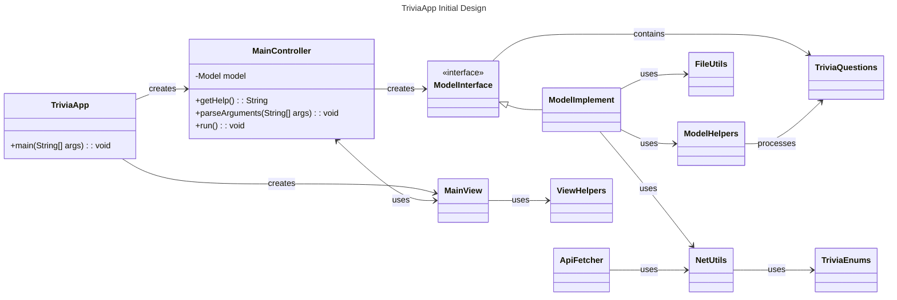

# Mock Directory Structure

## Project Root
- **Group8**
  - TriviaApp.java (main())
  - **Controller/**
    - MainController.java
    - ControllerHelper.java
  - **Model/**
    - ModelInterface.java
    - ModelImplement.java
    - ApiFetcher.java
    - ModelHelpers.java
    - TriviaEnums
    - **Utils/**
      - FileUtils.java
      - NetUtils.java
  - **View/**
    - MainView.java
    - ViewHelpers.java

# Mock UML Diagram

