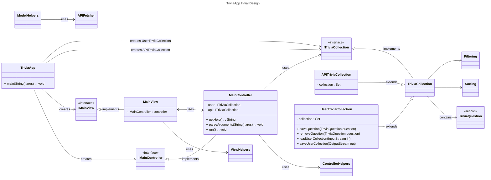

# Mock Directory Structure

## Project Root
- **Group8**
  - TriviaApp.java (main())
  - **Controller/**
    - IMainController.java
    - MainController.java
    - ControllerHelpers.java
  - **Model/**
    - ITriviaCollection.java
    - TriviaCollection.java
    - APITriviaCollection.java
    - UserTriviaCollection.java
    - Filtering.java
    - Sorting.java
    - ModelHelpers.java
    - **Utils/**
  - **View/**
    - IMainView.java
    - MainView.java
    - ViewHelpers.java

# Mock UML Diagram

